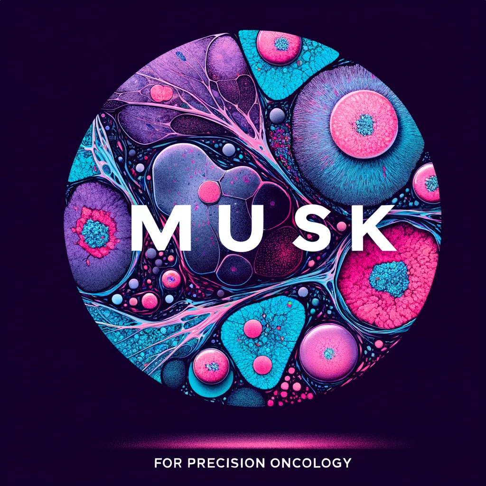

<!-- ## MUSK: A Vision-Language Foundation Model for Precision Oncology
(Nature 2024, in press) -->


(Nature 2025)

[Jinxi Xiang](https://jinxixiang.com/)‡, Xiyue Wang‡, Xiaoming Zhang, Yinghua Xi, Feyisope Eweje, Yijiang Chen, Yuchen
Li, Colin Bergstrom, Matthew Gopaulchan, Ted Kim, Kun-Hsing Yu, Sierra Willens, Francesca Maria
Olguin, Jeffrey J. Nirschl, Joel Neal, Maximilian Diehn, Sen Yang<sup>+</sup>, [Ruijiang Li](https://med.stanford.edu/lilab.html)<sup>+</sup> (‡Equal Contribution)

_Lead Contact_: Ruijiang Li, Ph.D.

Stanford University, Harvard University

-----




We develop **M**ultimodal transformer with **U**nified ma**SK** modeling (MUSK), a vision-language foundation model designed to leverage large-scale, unlabeled, unpaired image-text data. MUSK is pre-trained on 50 million pathology images and 1 billion pathology-related text tokens using unified masked modeling.  MUSK achieves superior performance across 23 patch-level and slide-level benchmarks, including cross-modal retrieval, visual question answering, and image classification. Importantly, MUSK shows promising performance in outcome prediction, including melanoma relapse prediction, pan-cancer prognosis prediction, and immunotherapy response prediction in lung and gastro-esophageal cancers. MUSK effectively combines complementary information from pathology images and clinical reports and can potentially improve diagnosis and precision cancer therapy.


## 📢 News

- **Jan 8, 2025**. The [MUSK paper](https://www.nature.com/articles/s41586-024-08378-w) has been published in *Nature*.


- **Nov 8, 2024**. Our manuscript, *"A Vision-Language Foundation Model for Precision Oncology,"* has been officially accepted by *Nature*.  

- **Nov 3, 2024**. The initial release of the **MUSK** model code. The model weights will be released once the paper is published online. 

## Installation

First clone the repo and cd into the directory:
```shell
git clone https://github.com/lilab-stanford/MUSK
cd MUSK
```

Create a new enviroment with anaconda.
```shell
conda create -n musk python=3.10 -y --no-default-packages
conda activate musk
pip install --upgrade pip
pip install -r requirements.txt
pip install -e .
```

## Model Download

The MUSK models can be accessed from [HuggingFace Hub](https://huggingface.co/xiangjx/musk).

You need to agree to the terms to access the models and login with your HuggingFace write token:
```python
from huggingface_hub import login
login(<huggingface write token>)
```


## Basic Usage: MUSK as a Vision-Language Encoder

Please refer to `demo.ipynb` for a demonstration. 


1. Load the MUSK model  

```python
import torch
from musk import utils, modeling
from timm.models import create_model
model = create_model("musk_large_patch16_384")
utils.load_model_and_may_interpolate("hf_hub:xiangjx/musk", model, 'model|module', '')
model.to(device="cuda", dtype=torch.float16)
model.eval()
```

2. Encode images with MUSK  (refer to `demo.ipynb` for complete implementation)
```python
import torchvision
from PIL import Image
from timm.data.constants import IMAGENET_INCEPTION_MEAN, IMAGENET_INCEPTION_STD

transform = torchvision.transforms.Compose([
    torchvision.transforms.Resize(384, interpolation=3, antialias=True),
    torchvision.transforms.CenterCrop((384, 384)),
    torchvision.transforms.ToTensor(),
    torchvision.transforms.Normalize(mean=IMAGENET_INCEPTION_MEAN, std=IMAGENET_INCEPTION_STD)
])

img = Image.open('assets/lungaca1014.jpeg').convert("RGB")  # input image
img_tensor = transform(img).unsqueeze(0)
with torch.inference_mode():
    image_embeddings = model(
        image=img_tensor.to("cuda", dtype=torch.float16),
        with_head=False,
        out_norm=False,
        ms_aug=True,
        return_global=True  
        )[0]  # return (vision_cls, text_cls)

```
- `with_head=True`: Enable head for image-text retrieval.  
- `out_norm=True`: Apply normalization.  
- `ms_aug=True`: Use multiscale augmentation (for tasks, e.g., linear probe classification, MIL).  
- `return_global=True`: Return only [CLS] token, exclude patch tokens.  


3. Encode texts with MUSK (refer to `demo.ipynb` for complete implementation)
```python
tokenizer = XLMRobertaTokenizer("./musk/models/tokenizer.spm")
text = ['histopathology image of lung adenocarcinoma']
txt_ids, pad = utils.xlm_tokenizer(txt, tokenizer, max_len=100)

with torch.inference_mode():
   text_embeddings = model(
      text_description=txt_ids,
      padding_mask=pad,
      with_head=False, 
      out_norm=True,
      ms_aug=False,
      return_global=True 
   )[1]  # return (vision_cls, text_cls)
```


## Evaluation on Patch-level Benchmarks

Please refer to `./benchmarks/demo.ipynb` for a demonstration. 

Patch-level benchmarks include image-text retrieval, zero-shot/few-shot/linear probe image classification, image-image retrieval, and more. The evaluation code is all-in-one which adapted from the [CLIP Benchmark](https://github.com/LAION-AI/CLIP_benchmark).

The evaluated dataset includes:
<small>
- **PathMMU** is available at [https://huggingface.co/datasets/jamessyx/PathMMU](https://huggingface.co/datasets/jamessyx/PathMMU).  
- **BookSet** and **PubmedSet** are available at [https://warwick.ac.uk/fac/cross_fac/tia/data/arch](https://warwick.ac.uk/fac/cross_fac/tia/data/arch).  
- **PatchCamelyon** can be accessed at [https://patchcamelyon.grand-challenge.org/](https://patchcamelyon.grand-challenge.org/).  
- **NCT-CRC-HE-100K** dataset is available at [https://zenodo.org/record/1214456](https://zenodo.org/record/1214456).  
- **SICAPv2** can be downloaded from [https://data.mendeley.com/datasets/9xxm58dvs3/1](https://data.mendeley.com/datasets/9xxm58dvs3/1).  
- **Osteo** dataset is available at [https://www.cancerimagingarchive.net/collection/osteosarcoma-tumor-assessment/](https://www.cancerimagingarchive.net/collection/osteosarcoma-tumor-assessment/).  
- **RenalCell** can be downloaded from [https://zenodo.org/records/6528599](https://zenodo.org/records/6528599).  
- **SkinCancer** is accessible at [https://www.isic-archive.com/](https://www.isic-archive.com/).  
- **LC25000** dataset is available for download at [https://github.com/tampapath/lung_colon_image_set](https://github.com/tampapath/lung_colon_image_set).  
- **PanNuke** can be accessed at [https://warwick.ac.uk/fac/cross_fac/tia/data/pannuke](https://warwick.ac.uk/fac/cross_fac/tia/data/pannuke).  
- **UniToPatho** dataset is available at [https://ieee-dataport.org/open-access/unitopatho](https://ieee-dataport.org/open-access/unitopatho).  
- **WSSS4LUAD** can be downloaded from [https://wsss4luad.grand-challenge.org/WSSS4LUAD/](https://wsss4luad.grand-challenge.org/WSSS4LUAD/).  
- **BRACS** datasets for 3 and 6 classes are available for download at [https://www.bracs.icar.cnr.it/](https://www.bracs.icar.cnr.it/).  

</small>

To begin, download the required datasets. For demonstration purposes, we provide example datasets available [here](https://drive.google.com/file/d/1FCGRn6mtdrw8l3WAR_U76V0eRBnsQxD1/view?usp=sharing). The UniToPatho dataset has been downsampled to 224×224 resolution to enable faster downloads, as the original dataset exceeds 300GB in size. (As such, performance may vary slightly compared to the results reported in the paper.) Once downloaded, unzip the dataset to a local directory, such as `/root/to/downstreams_demo`. Next, update the directory path to `dataset_root=/root/to/downstreams_demo`. The code will then automatically extract features and carry out evaluations.

The main file is `clip_benchmark.cli` and includes the following options:
- `--pretrained_model`: Specifies the model name and the path to its weights.
- `--dataset`: Indicates the evaluation dataset(s); multiple datasets can be specified.
- `--dataset_root`: The root of datasets.
- `--task`: Defines the evaluation task.
- `--batch_size`: Sets the batch size for feature extraction.
- `--output`: Specifies where to save the output results.

Set the `models.txt` file with entries in the format: `(model_name, model_path)`. If you want to run both MUSK and [CONCH](https://github.com/mahmoodlab/CONCH) for comparison, your `models.txt` might look like this:
```shell
musk_large_patch16_384,hf_hub:xiangjx/musk
conch,/path/to/conch.pt
```
Alternatively, you can remove the CONCH entry and run MUSK alone.

Some example commands:

```shell
# >>>>>>>>>>> zero-shot image-text retrieval >>>>>>>>>>> #
 python3 -m clip_benchmark.cli eval --pretrained_model models.txt \
        --dataset   "pathmmu_retrieval"  \
        --task "zeroshot_retrieval" \
        --batch_size 256 \
        --num_workers 8 \
        --seed 42 \
        --recall_k 1 10 50 \
        --dataset_root "/root/to/downstreams_demo" \
        --output "./results/benchmark_mm_retrieval.json"
```


```shell
# >>>>>>>>>>> few-shot image classification >>>>>>>>>>> #
for k_shot in "${shot_list[@]}"
do
  for seed in "${seed_list[@]}"
  do
      python3 -m clip_benchmark.cli eval --pretrained_model models.txt \
          --dataset  "skin" "pannuke" "unitopatho" \
          --task "linear_probe" \
          --batch_size 256 \
          --num_workers 8 \
          --fewshot_k $k_shot \
          --seed $seed \
          --dataset_root "/root/to/downstreams_demo" \
          --output "./results/benchmark_fs_${k_shot}shot_seed${seed}.json"
  done
done
```

```shell
# >>>>>>>>>>> zero-shot image2image retrieval >>>>>>>>>>> #
python3 -m clip_benchmark.cli eval --pretrained_model models.txt \
        --dataset   "unitopatho_retrieval" \
        --task "image_retrieval" \
        --batch_size 256 \
        --num_workers 8 \
        --seed 41 \
        --dataset_root "/root/to/downstreams_demo" \
        --output "./results/benchmark_image_retrieval.json"
```

and more tasks in `./benchmarks/demo.ipynb`.


## Acknowledgements

The project was built on many amazing open-source repositories: [Quilt1M](https://github.com/wisdomikezogwo/quilt1m), [PathAsst](https://github.com/superjamessyx/Generative-Foundation-AI-Assistant-for-Pathology), [torchscale](https://github.com/microsoft/torchscale), [accelerate](https://github.com/huggingface/accelerate) (model pretraining), [deepspeed](https://github.com/microsoft/DeepSpeed) (model pretraining), [pytorch-lightning](https://github.com/Lightning-AI/pytorch-lightning) (downstream finetuning), [CLIP Benchmark](https://github.com/LAION-AI/CLIP_benchmark) (model evaluation), and  [PORPOISE](https://github.com/mahmoodlab/PORPOISE/tree/master) (prognosis). We thank the authors and developers for their contributions.

## Issues
- Please open new threads or address questions to xiangjx@stanford.edu or xiyue.wang.scu@gmail.com

## License

This model and associated code are released under the CC-BY-NC-ND 4.0 license and may only be used for non-commercial, academic research purposes with proper attribution. Any commercial use, sale, or other monetization of the MUSK model and its derivatives, which include models trained on outputs from the MUSK model or datasets created from the MUSK model, is prohibited and requires prior approval.
